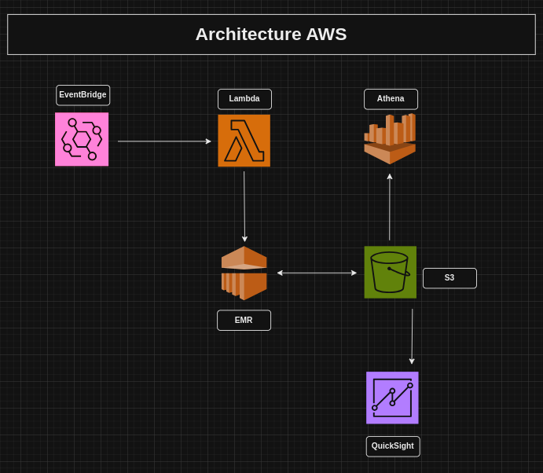

# Restitution Kata Exalt-IT

---

## I. Développement en local 

Pour ce kata, j'ai mis en place une poc d'une chaîne de traitement ETL en python et pyspark qui va s'executer toutes 
les deux heures grâce à un cron.

Pour le developpement en local mon projet est organisé de la manière suivante : 

**data-flight-rader**
* **configuration**
  * etl.json
* **src**
  * etl
    * extract.py
    * transform.py
    * load.py
  * utils.py
  * main.py
  * main.ipynb
* **data**
  * raw
    * fligts /
  * transformed
    * aircraft_manufacturer_with_most_active_flights /
    * airline_with_most_active_regional_flights_by_continent /
    * airline_with_most_flights /
    * average_flight_length_by_continent /
    * longest_flight /

### 1. configuration

La configuration des différentes étapes de l'etl

### 2. src 

* **utils.py**

Les éléments partagés par le code source

* **extract.py**

Extraire les données de vols (flights) depuis l'api FlightRadar24 et les stockés dans le
repertoire data/raw/fligts/date=[date]/hour=[hour] dans un format csv pour que cela soit human-readable. 
Et le partitionnement reduit l'effet de la grande volumetrie et on peut mettre en place aussi un système de purge pour n'avoir que les données de vols des 3 derniers jours à chaque fois.

* **transform.py**

Transformer la dernière partition des données de vols extraites et stockées en ne gardant que les vols
avec une compagnie aerienne. On transforme les données pour avoir les indicateurs suivants:

> **aircraft_manufacturer_with_most_active_flights** 

> **airline_with_most_active_regional_flights_by_continent** 

> **airline_with_most_flights** 

> **average_flight_length_by_continent** 

> **longest_flight** 

Chaque indicateur est stocké dans le repertoire data/transformed/[indicateur]/date=[date]/hour=[hour]
dans un format csv parce que les indicateurs sont aggrégés et partitionnés. On peut également mettre en place un système de purge à la longue.

* **load.py**

Dans ce contexte pour le load, je charge juste les differents indicateurs calculés pour les afficher.

* **main.py**

Lance toute la chaîne de traitement.

* **main.ipynb**

Un notebook dans lequel, on trouve une petite demo de mon etl

### 3. data

Le repertoire de stockage des données extraites et transformées. Les données sont partitionnées
pour reduire l'effet de la volumetrie et aussi un système de purge peut être mis en place
pour nettoyer le repertoire.

### 4. Demo 

Une demo de mon etl est donnée dans le notebook main.ipynb

## II. Industrialisation et deploiement dans un environnement de prod

J'envisage de deployer cette solution dans un environnement AWS avec l'architecture suivante : 

### 1. EventBridge

Pour mettre en place un cron qui fait tourner le job toutes les deux heures. 

### 2. Lambda

Déclenchée par le cron, elle déclenche à son tour une EMR pour lancer la chaîne de traitement ETL.

### 3. EMR

Déclenchée par la lambda, elle lance la chaîne de traitement etl sous forme de step. Le code source éxécuté est
stocké sur S3 et ajouté au main de la step via la méthode **addPyFile de spark**.

### 4. S3

Pour stocker le code source, la configuration de l'etl et les données extraites et transformées. On aura quatre buckets
* etl-configuration pour la configuration de l'etl
* etl-src pour le code source 
* etl-data pour les données
* etl-log pour les logs produits par le cluster EMR

### 5. Athena

Les données stockées sur s3 sont utilisées dans athena pour créer des tables afin de pouvoir faire des analyses avec des requêtes sql.

### 6. QuickSight

Les données transformées stockées sur S3 sont utilisées pour alimenter un dashboard dans quicksight pour présenter les indicateurs
calculés. 

### Fonctionnement

Le cron de **EventBridge** déclenche une **lambda fonction** qui prépare les configurations d'un **cluster EMR** et le lance.
Via le cluster EMR, la chaîne etl est lancée et les données sont stockées sur **S3**. Avec ces données, on peut créer des tables sur **Athena** pour faire du requêtage. Et les données transformées sur S3 sont utilisées pour alimenter un dashboard sur **QuickSight**.